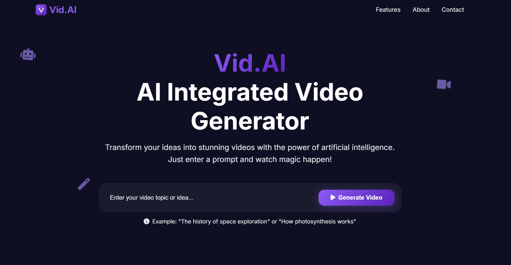

<div align="center">


# Vid.AI

### AI-Powered Video Generator Web Application

[](https://www.python.org/)
[](https://flask.palletsprojects.com/)
[](https://socket.io/)

<p>Transform your ideas into stunning videos with the power of artificial intelligence</p>

</div>

## 📋 Table of Contents
- [✨ Features](#-features)
- [🌐 Web Application](#-web-application)
- [🚀 Installation](#-installation)
- [⚙️ Configuration](#️-configuration)
- [💻 Usage](#-usage)
- [🏛️ Architecture](#️-architecture)
- [🔧 Components](#-components)
- [🎬 Video Generation Process](#-video-generation-process)
- [👥 Team](#-team)
- [📝 License](#-license)

## ✨ Features

### 🧠 AI-Powered
- GPT-3.5 script generation via OpenRouter API
- Automatically selects perfect visuals from Pexels
- Natural voice narration with text-to-speech
- Smart video composition with proper pacing

### ⚡ Lightning Fast
- Generate videos in minutes, not hours
- Efficient processing pipeline
- Automatic content search and caching
- Smart search for similar existing videos

### 🎨 Beautiful Design
- Stunning visual transitions and Ken Burns effects
- Professional audio narration with synchronized subtitles
- Clean, modern violet-themed web interface
- Responsive design for all devices

## 🌐 Web Application

Vid.AI features an elegant violet-themed web interface:

- **Interactive Dashboard**: Beautiful UI with animations and gradients
- **Real-time Progress**: Live updates of each step in the generation process
- **Smart Caching**: Automatically finds similar videos to avoid duplicates
- **Educational Facts**: Learn interesting tidbits while your video generates
- **Simple Downloads**: Easy access to your finished videos

<div align="center">

</div>

## 🚀 Installation

### Prerequisites
- Python 3.9+
- FFmpeg (for video processing)
- Internet connection (for API access)

### Setup

```bash
# Clone the repository
git clone https://github.com/mugdh04/Vid.AI.git
cd Vid.AI

# Create and activate virtual environment
python -m venv venv
source venv/bin/activate  # On Windows: venv\Scripts\activate

# Install dependencies
pip install -r requirements.txt
```

## ⚙️ Configuration

Create a `.env` file in the project root:

```
OPENROUTER_API_KEY=your_api_key_here
PEXELS_API_KEY=your_pexels_api_key_here
```

You'll need to obtain API keys from:
- [OpenRouter](https://openrouter.ai/) for AI script generation
- [Pexels](https://www.pexels.com/api/) for images and videos

## 💻 Usage

### Web Application

1. **Start the server**
   ```bash
   python webapp.py
   ```

2. **Open the application**
   ```
   http://localhost:5000
   ```

3. **Generate a video**
   - Enter your topic
   - Click "Generate Video"
   - Watch the progress in real-time
   - Download when complete

### Command Line

For quick generation without the web interface:

```bash
python app.py "Your video topic here"
```

## 🏛️ Architecture

Vid.AI follows a modular architecture:

```
User Input → Script Generation → Audio Creation → Media Fetching → Video Assembly → Final Video
```

### Project Structure

```
Vid.AI/
├── app.py                   # CLI entry point
├── webapp.py                # Flask web server
├── generate_script.py       # AI script generation
├── generate_audio.py        # Text-to-speech
├── fetch_media.py           # Image and video fetching
├── create_video.py          # Video assembly
├── video_search.py          # Similar video search
├── static/                  # Web assets
├── templates/               # HTML templates
├── output/                  # Generated videos
└── audio/, images/          # Temporary media storage
```

## 🔧 Components

### Script Generator
- Uses GPT-3.5 via OpenRouter API
- Creates educational narratives with visual cues
- Automatically formats for video creation

### Audio Generator
- Converts script to natural-sounding speech
- Selects optimal female voice when available
- Adjusts speed and clarity for best results

### Media Fetcher
- Searches Pexels for relevant videos and images
- Intelligent selection based on keywords
- Handles portrait/landscape detection

### Video Creator
- Assembles all components into final video
- Adds Ken Burns effects and transitions
- Creates clean subtitles and timing

## 🎬 Video Generation Process

1. **Topic Analysis**
   - AI processes your topic for optimal content

2. **Script Creation**
   - Creates educational narrative and visual cue keywords

3. **Audio Generation**
   - Converts script to natural-sounding narration

4. **Media Selection**
   - Fetches relevant videos and images
   - Applies visual effects and formatting

5. **Video Assembly**
   - Combines all elements with precise timing
   - Adds subtitles and transitions

6. **Delivery**
   - Final video ready for download and sharing

## 👥 Team

<div align="center">
  <table>
    <tr>
      <td align="center">
        <a href="https://github.com/mugdh04">
          
          <br />
          <b>Mugdh Kumar Sharma</b>
        </a>
      </td>
      <td align="center">
        <a href="https://github.com/twin007">
          
          <br />
          <b>Twinkle Kaushik</b>
        </a>
      </td>
    </tr>
  </table>
</div>

<div align="center">
  <p>Contact: teamVidAI@gmail.com</p>
</div>

## 📝 License

This project is licensed under the MIT License.

<div align="center">
  <p>Made with 💜 by Team Vid.AI</p>
  <p>© 2025 All Rights Reserved</p>
</div>