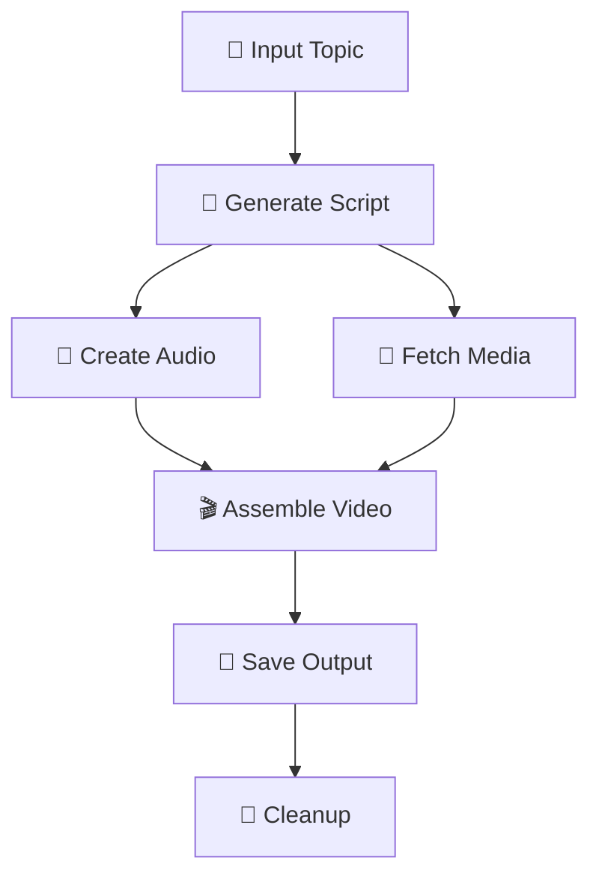

# 🎬 Vid.AI - AI-Powered Educational Video Generator

<div align="center">


[](https://python.org)
[](https://zulko.github.io/moviepy/)
[](https://www.pexels.com/api/)
[](https://openrouter.ai/)

**Transform any topic into engaging educational videos with AI! 🚀**

</div>

---

## 📋 Table of Contents
- [✨ Features](#-features)
- [🎯 What Vid.AI Does](#-what-vidai-does)
- [🛠️ Installation](#️-installation)
- [⚙️ Configuration](#️-configuration)
- [🚀 Usage](#-usage)
- [📁 Project Structure](#-project-structure)
- [🔧 Components](#-components)
- [🎨 Video Generation Process](#-video-generation-process)
- [📸 Media Sources](#-media-sources)
- [🎵 Audio Features](#-audio-features)
- [🔍 Troubleshooting](#-troubleshooting)
- [🤝 Contributing](#-contributing)
- [📄 License](#-license)

---

## ✨ Features

🎭 **AI-Powered Script Generation**
- Generates educational narratives using Google Gemini 2.0 Flash
- Creates matching visual cues automatically
- Optimized for 1-minute educational content

🎙️ **Natural Text-to-Speech**
- Female voice synthesis using pyttsx3
- Smooth, humanized audio output
- Adjustable speech rate for clarity

🎬 **Dynamic Video Creation**
- Intelligent mix of videos and images from Pexels
- Ken Burns effect for static images
- Portrait video detection with automatic fallback
- Professional subtitle overlay

🔄 **Smart Media Management**
- Automatic landscape video preference
- Fallback to images when needed
- Auto-cleanup of temporary files
- Resource-efficient processing

⚡ **Real-time Progress Tracking**
- Live updates during video generation
- Detailed backend operation logs
- Error handling with fallback options

---

## 🎯 What Vid.AI Does

Vid.AI transforms any educational topic into a professional video by:

1. 🧠 **Generating intelligent scripts** using AI
2. 🎤 **Creating natural-sounding narration**
3. 📸 **Fetching relevant visual content**
4. 🎞️ **Assembling everything into a polished video**
5. 🧹 **Cleaning up automatically**

### 📊 Input → Output Flow

```
📝 Topic Input → 🤖 AI Script → 🎤 Audio → 📷 Media → 🎬 Final Video
```

---

## 🛠️ Installation

### Prerequisites
- 🐍 Python 3.8 or higher
- 🔑 API keys for Pexels and OpenRouter

### Step 1: Clone the Repository
```bash
git clone https://github.com/yourusername/vid-ai.git
cd vid-ai
```

### Step 2: Install Dependencies
```bash
pip install -r requirements.txt
```

### Step 3: Install Additional Requirements
```bash
pip install moviepy requests python-dotenv pyttsx3 pillow
```

---

## ⚙️ Configuration

### 🔐 Environment Variables

Create a `.env` file in the project root:

```env
# Pexels API Key (Get from https://www.pexels.com/api/)
PEXELS_API_KEY=your_pexels_api_key_here

# OpenRouter API Key (Get from https://openrouter.ai/)
OPENROUTER_API_KEY=your_openrouter_api_key_here
```

### 🔑 Getting API Keys

#### Pexels API Key
1. Visit [Pexels API](https://www.pexels.com/api/)
2. Sign up for a free account
3. Generate your API key
4. Add it to your `.env` file

#### OpenRouter API Key
1. Visit [OpenRouter](https://openrouter.ai/)
2. Create an account
3. Generate an API key
4. Add it to your `.env` file

---

## 🚀 Usage

### Basic Usage
```bash
python app.py "Your Educational Topic Here"
```

### Examples
```bash
# Generate a video about Python programming
python app.py "Introduction to Python Programming"

# Create a history lesson
python app.py "The French Revolution"

# Make a science explanation
python app.py "How Photosynthesis Works"
```

### 📤 Output
Your generated video will be saved in the `output/` folder as:
```
output/Your_Topic_Name_video.mp4
```

---

## 📁 Project Structure

```
Vid.AI/
├── 📄 app.py                 # Main application entry point
├── 🤖 generate_script.py     # AI script generation
├── 🎤 generate_audio.py      # Text-to-speech conversion
├── 📸 fetch_media.py         # Pexels API media fetching
├── 🎬 create_video.py        # Video assembly and processing
├── 📝 generate_subtitles.py  # Subtitle generation (optional)
├── 🌍 .env                   # Environment variables
├── 📋 requirements.txt       # Python dependencies
├── 📖 README.md             # This file
├── 📁 output/               # Generated videos
├── 📁 images/               # Temporary image storage
├── 📁 videos/               # Temporary video storage
└── 📁 audio/                # Temporary audio storage
```

---

## 🔧 Components

### 🧠 Script Generator (`generate_script.py`)
- Uses Google Gemini 2.0 Flash model
- Generates educational narratives
- Creates matching visual cues
- Optimized for 1-minute content

### 🎙️ Audio Generator (`generate_audio.py`)
- Text-to-speech using pyttsx3
- Female voice selection
- Natural speech rate (155 WPM)
- MP3 output format

### 📸 Media Fetcher (`fetch_media.py`)
- Fetches videos and images from Pexels
- Prefers landscape videos
- Fallback to images when needed
- HD quality selection

### 🎬 Video Creator (`create_video.py`)
- Combines all elements into final video
- Ken Burns effect for images
- Smart subtitle placement
- Portrait video detection
- Resource cleanup

---

## 🎨 Video Generation Process


```mermaid
graph TD
    A[📝 Input Topic] --> B[🤖 Generate Script]
    B --> C[🎤 Create Audio]
    B --> D[📸 Fetch Media]
    C --> E[🎬 Assemble Video]
    D --> E
    E --> F[💾 Save Output]
    F --> G[🧹 Cleanup]
```

### 🔄 Step-by-Step Process

1. **📝 Script Generation**
   - AI analyzes your topic
   - Generates educational narrative
   - Creates visual cue keywords

2. **🎤 Audio Creation**
   - Converts script to speech
   - Uses natural female voice
   - Saves as MP3 file

3. **📸 Media Fetching**
   - Searches for relevant videos/images
   - Downloads HD content
   - Organizes by keyword

4. **🎬 Video Assembly**
   - Combines media with audio
   - Adds professional subtitles
   - Applies visual effects
   - Renders final video

5. **🧹 Cleanup**
   - Removes temporary files
   - Keeps only final video

---

## 📸 Media Sources

### 🎥 Video Content
- **Source**: Pexels Videos API
- **Quality**: HD (up to 1920px width)
- **Format**: MP4
- **Orientation**: Landscape preferred

### 🖼️ Image Content
- **Source**: Pexels Photos API
- **Quality**: Landscape format
- **Format**: JPEG
- **Effects**: Ken Burns animation

### 🎯 Smart Media Selection
- ✅ Prefers landscape videos
- ✅ Falls back to images for portrait videos
- ✅ Matches content to narrative keywords
- ✅ Ensures visual variety

---

## 🎵 Audio Features

### 🎙️ Voice Characteristics
- **Gender**: Female voice preferred
- **Rate**: 155 words per minute
- **Engine**: pyttsx3 (offline TTS)
- **Quality**: Natural, humanized tone

### 🔧 Audio Processing
- **Format**: MP3
- **Synchronization**: Perfect audio-visual sync
- **Duration**: Matches video length exactly
- **Volume**: Optimized for clarity

---

## 🔍 Troubleshooting

### ❌ Common Issues

#### API Key Errors
```bash
Error: PEXELS_API_KEY not found
```
**Solution**: Check your `.env` file and ensure API keys are set correctly.

#### No Media Found
```bash
Warning: No media found for keyword
```
**Solution**: The script will automatically fall back to topic-based searches.

#### Video Processing Errors
```bash
Error processing video: Portrait video detected
```
**Solution**: Vid.AI automatically switches to images for portrait videos.

#### Audio Generation Issues
```bash
Error: No female voice found
```
**Solution**: The system will use the default voice if no female voice is available.

### 🆘 Debug Mode
Add debug prints by modifying the script generation:
```python
# Enable verbose logging
import logging
logging.basicConfig(level=logging.DEBUG)
```

---

## 🎯 Best Practices

### 📝 Topic Selection
- ✅ Use specific, educational topics
- ✅ Keep topics focused and narrow
- ✅ Examples: "How Photosynthesis Works" not "Biology"

### 🔧 Performance Tips
- 🚀 Ensure stable internet connection
- 🚀 Use topics with rich visual content
- 🚀 Run during off-peak hours for faster API responses

### 💡 Content Quality
- 📚 Educational topics work best
- 📚 Historical events generate great visuals
- 📚 Scientific processes are ideal for explanation

---

## 🤝 Contributing

We welcome contributions! Here's how you can help:

### 🐛 Bug Reports
1. Check existing issues
2. Create detailed bug report
3. Include error logs and steps to reproduce

### ✨ Feature Requests
1. Open an issue with feature description
2. Explain use case and benefits
3. Discuss implementation approach

### 🔧 Code Contributions
1. Fork the repository
2. Create feature branch
3. Make your changes
4. Add tests if applicable
5. Submit pull request

### 📝 Development Setup
```bash
# Clone your fork
git clone https://github.com/yourusername/vid-ai.git

# Create virtual environment
python -m venv venv
source venv/bin/activate  # On Windows: venv\Scripts\activate

# Install development dependencies
pip install -r requirements.txt
```

---

## 🙏 Acknowledgments

- 🤖 **Google Gemini 2.0 Flash** for intelligent script generation
- 📸 **Pexels** for providing high-quality free media content
- 🎬 **MoviePy** for powerful video processing capabilities
- 🎙️ **pyttsx3** for offline text-to-speech conversion
- 🌐 **OpenRouter** for AI model access

---

## 📊 Stats & Performance

| Metric | Value |
|--------|-------|
| 📝 Script Generation | ~10-15 seconds |
| 🎤 Audio Creation | ~5-10 seconds |
| 📸 Media Fetching | ~20-30 seconds |
| 🎬 Video Assembly | ~30-60 seconds |
| 📁 Total Process | ~1-2 minutes |

---

## 🔮 Future Enhancements

- 🎯 Multi-language support
- 🎨 Custom visual themes
- 📱 Mobile app integration
- 🔊 Voice cloning capabilities
- 📈 Analytics dashboard
- 🎭 Animated characters
- 🌍 Multi-platform publishing

---

## 📄 License

This project is licensed under the MIT License - see the [LICENSE](LICENSE) file for details.

---

## 💬 Support

- 📧 **Email**: support@vid-ai.com
- 💬 **Discord**: [Join our community](https://discord.gg/vid-ai)
- 🐛 **Issues**: [GitHub Issues](https://github.com/yourusername/vid-ai/issues)
- 📖 **Docs**: [Full Documentation](https://vid-ai.readthedocs.io)

---

<div align="center">

### 🌟 Star us on GitHub if you like this project! 🌟

**Made with ❤️ by the Vid.AI Team**


</div>
